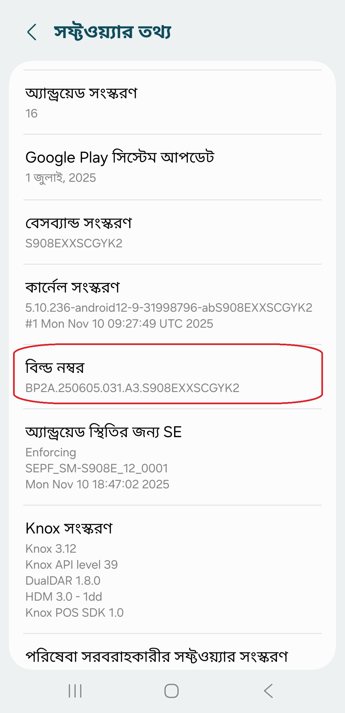
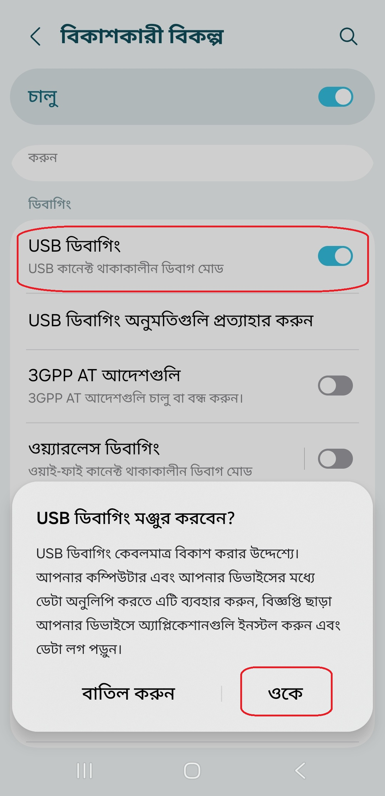
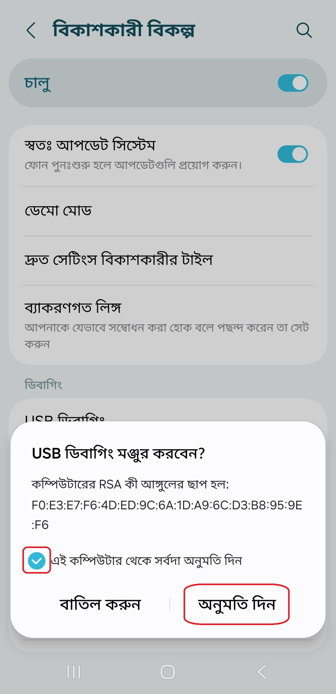

[English](../../README.md) | [Español](../es/README.md)
| [Português](../pt/README.md) | [Bahasa Indonesia](../in/README.md)
| [Русский](../ru/README.md) | [中文 (简体)](../zh-rCN/README.md)
| [日本語](../ja-rJP/README.md) | [Tiếng Việt](../vi/README.md)
| [Türkçe](../tr/README.md)
| [हिन्दी](../hi/README.md) | <u>[বাংলা (ভারত)](README.md)</u> | [ਪੰਜਾਬੀ (ਭਾਰਤ)](../pa-rIN/README.md) | [اردو (پاکستان)](../ur-rPK/README.md) | [العربية](../ar/README.md) | [ไทย](../th/README.md)

# Pixels - স্মার্ট রেজোলিউশন এবং ডিপিআই চেঞ্জার

* [গুগল প্লে স্টোর](https://play.google.com/store/apps/details?id=com.tribalfs.pixels)

Pixels-এর কাজ করার জন্য **WRITE_SECURE_SETTINGS** অনুমতি প্রয়োজন (এটি রুটিং নয়)।

----------------------

### সংক্ষেপে (TL;DR)

* `adb shell pm grant com.tribalfs.pixels android.permission.WRITE_SECURE_SETTINGS` চালান
* যদি উচ্চতর অনুমতি সহ অ্যান্ড্রয়েড টার্মিনাল অ্যাপ ব্যবহার করেন,
  `pm grant com.tribalfs.pixels android.permission.WRITE_SECURE_SETTINGS` চালান

----------------------

পিসি (PC) ব্যবহার করে ADB পদ্ধতি:
----------------------

<details>

### ১. ফোনের সেটিংসে ডেভেলপার মোড সক্ষম করুন

<details>

* ডেভেলপার অপশন সক্ষম করতে _সেটিংস_ > _ফোন সম্পর্কে_ > _সফ্টওয়্যার তথ্য_-এ যান এবং _विल् तमन_-এ
  টানা সাত (৭) বার ট্যাপ করুন।

  

</details>

### ২. ইউএসবি ডিবাগিং (USB debugging) সক্ষম করুন

<details>

* _সেটিংস_ > _বিকাশকারী বিকল্প_-এ যান (পুরানো অ্যান্ড্রয়েড সংস্করণে এটি _সেটিংস_ > _সিস্টেম_ >
  _বিকাশকারী বিকল্প_ হতে পারে), নিচে স্ক্রোল করুন এবং _USB ডিবাগিং_ অপশনটি খুঁজুন। ওই অপশনটি চালু
  করুন।

  

#### কিছু ডিভাইসের জন্য নোট (যেমন MIUI):

* ডেভেলপার অপশনে থাকলে _নিরাপত্তা সেটিংসের জন্য USB ডিবাগিং_ অপশনটিও চালু করুন।

* ডেভেলপার অপশনে থাকলে _অনুমতি নিরীক্ষণ অক্ষম করুন_ অপশনটি চালু করুন। রিবুট প্রয়োজন।

</details>

### ৩. আপনার কম্পিউটারে ADB ডাউনলোড করুন

<details>

* আপনার কম্পিউটারে ADB (platform-tools) ডাউনলোড করুন:
  [উইন্ডোজ](https://dl.google.com/android/repository/platform-tools-latest-windows.zip)-এর জন্য |
  [ম্যাক](https://dl.google.com/android/repository/platform-tools-latest-darwin.zip)-এর জন্য |
  [লিনাক্স](https://dl.google.com/android/repository/platform-tools-latest-linux.zip)-এর জন্য

* ডাউনলোড করা জিপ ফাইলটি আনজিপ (Extract) করুন।

</details>

### ৪. ফোল্ডারে প্রবেশ করুন

উইন্ডোজ এক্সপ্লোরার বা ফাইন্ডার (macOS)-এ আপনার আনজিপ করা `platform-tools` ফোল্ডারের ভিতরে যান।

### ৫. কমান্ড-লাইন ইন্টারফেস খোলা

  <details>

#### উইন্ডোজের জন্য: সিএমডি (CMD) খুলুন

* অ্যাড্রেস বারে `cmd` লিখুন এবং এন্টার চাপুন। এটি উইন্ডোজ কমান্ড প্রম্পট অ্যাপ্লিকেশনটি খুলবে।

  

#### MacOS-এর জন্য: টার্মিনাল (Terminal) খুলুন

* Launchpad থেকে `Terminal` খুঁজুন এবং এটি চালান।

* `sudo -s` চালান এবং আপনার ব্যবহারকারীর পাসওয়ার্ড দিন। **টার্মিনাল আপনি কয়টি অক্ষর টাইপ করছেন তা
  প্রদর্শন করবে না, এটি ফাঁকা থাকবে।**

* `export PATH=.:$PATH` চালান

**এটি ছাড়া আপনি `adb: command not found` ত্রুটি পাবেন।**

</details>

### ৬. আপনার ফোনকে কম্পিউটারের সাথে সংযুক্ত করা

  <details>

* আপনার ফোন প্রথমবারের মতো ইউএসবি ডিবাগিং মোডে সংযুক্ত হলে _USB जितानिश यखूत कतरवन?_ পপ-আপ দেখাবে।
  _उनूयरि मिन ট্যাপ করুন।
* আপনি _এই কম্পিউটার থেকে সর্বদা অনুমতি দিন_ চেক করতে পারেন (ইউএসবি ডিবাগিং চালু রাখার বিষয়ে এই
  টিউটোরিয়ালের শেষে নোটটি দেখুন)।

  

* নিচের কমান্ডটি লিখে এন্টার চাপুন। সফলভাবে সংযুক্ত হলে এটি আপনার ডিভাইসের আইডি প্রদর্শন করবে।

> ```adb devices```


#### macOS-এর জন্য: ```./adb devices ```

* যদি আপনার ডিভাইসটি কম্পিউটারের সাথে সংযুক্ত হতে ব্যর্থ হয়, তবে অন্য একটি ইউএসবি পোর্টে সংযোগ করার
  চেষ্টা করুন এবং/অথবা অন্য একটি ইউএসবি ডেটা কেবল ব্যবহার করুন। যদি তবুও সংযুক্ত না হয়, তবে সম্ভবত
  আপনার কম্পিউটারে আপনার ফোনের জন্য ইউএসবি ড্রাইভার নেই।
  [ওইএম (OEM) ইউএসবি ড্রাইভার ডাউনলোড করতে এখানে দেখুন](https://developer.android.com/studio/run/oem-usb#Drivers)।
  ইনস্টল করার পরে, আপনার পিসি রিবুট করুন এবং ৬ নম্বর ধাপটি আবার করুন।

</details>

### ৭. পিক্সেলকে (Pixels) WRITE_SECURE_SETTINGS অনুমতি প্রদান

  <details>

* সফলভাবে সংযুক্ত হলে, নিচের কমান্ডটি লিখুন এবং এন্টার চাপুন। আপনি নিচের কমান্ডটি কপি করতে পারেন।
  কমান্ডটি সঠিকভাবে কার্যকর হলে এটি ফাঁকা রিটার্ন করবে।

> ```adb shell pm grant com.tribalfs.pixels android.permission.WRITE_SECURE_SETTINGS```

* যদি এটি `adb.exe: more than one device/emulator...` দেখায়, তবে এর পরিবর্তে নিচের কমান্ডটি চালান:

>
```adb -s [৬ নম্বর ধাপে দেখানো ডিভাইস আইডি] shell pm grant com.tribalfs.pixels android.permission.WRITE_SECURE_SETTINGS```


#### macOS-এর জন্য:

```./adb shell pm grant com.tribalfs.pixels android.permission.WRITE_SECURE_SETTINGS ```

#### MIUI, OnePlus এবং কিছু অন্যান্য ডিভাইসের জন্য নোট

যদি আপনি `java.lang.SecurityException: grantRuntimePermission` ত্রুটি পান, তবে এই পদক্ষেপগুলি অনুসরণ
করুন:

১. _সেটিংস_ > _বিকাশকারী বিকল্প_-এ যান ( _সেটিংস_ > _System_ > _বিকাশকারী বিকল্প_ হতে পারে)
২. নিচে স্ক্রোল করুন এবং **নিরাপত্তা সেটিংসের জন্য USB ডিবাগিং** সক্ষম করুন
৩. যদি কোনো সতর্কবার্তা দেখায়, তবে এগিয়ে যাওয়ার জন্য পদক্ষেপগুলি অনুসরণ করুন।
৪. আপনার ডিভাইসটি রিবুট করুন এবং ৭ নম্বর ধাপটি আবার চেষ্টা করুন।

**ব্যাস!**
</details>

#### আপনি এখন ইউএসবি ডিবাগিং সেটিংস অক্ষম করতে পারেন

* **গুরুত্বপূর্ণ**: আপনি যদি আপনার ডিভাইসে নতুন কোনো স্ক্রিন রেজোলিউশন পরীক্ষা করতে চান যা
  সম্ভাব্যভাবে সিস্টেমকে ক্র্যাশ করতে পারে, তবে ইউএসবি ডিবাগিং সক্ষম রাখুন। ৬ নম্বর ধাপে _এই
  কম্পিউটার থেকে সর্বদা অনুমতি দিন_ চেক করা থাকতে হবে। স্ক্রিন রেজোলিউশন রিসেট করার এডিবি কমান্ড:
  `adb shell wm size reset` এবং `adb shell wm density reset`।

* যদি আপনার ইউএসবি ডিবাগিংয়ের প্রয়োজন না হয়, তবে অবাঞ্ছিত অ্যাক্সেস এড়াতে আপনি এখন ইউএসবি
  ডিবাগিং সেটিংস অক্ষম করতে পারেন।

* _সেটিংস_ > _বিকাশকারী বিকল্প_-এ যান, নিচে স্ক্রোল করুন এবং _USB ডিবাগিং_ অপশনটি **অক্ষম**
  করুন।

----------------------
[ভিডিও গাইড](https://youtu.be/hKxc8wqanxA)

</details>

----------------------

পিসি ব্যবহার না করে ADB পদ্ধতি:
----------------------
<details>

### বিকল্প ১: আপনি [Shizuku](https://play.google.com/store/apps/details?id=moe.shizuku.privileged.api) ইনস্টল করতে পারেন

এবং নির্দেশাবলী অনুসরণ করে এটি সক্রিয় করতে পারেন।  
এরপর, _Pixels_ অ্যাপে ফিরে যান এবং রেজোলিউশন প্রয়োগ করে এটিকে অনুমতি দিন।

### বিকল্প ২: আপনি [LADB](https://github.com/tribalfs/LADB/releases) ইনস্টল করতে পারেন

এর সেটআপ গাইড অনুসরণ করুন এবং নিচের কমান্ডটি চালান:

`pm grant com.tribalfs.pixels android.permission.WRITE_SECURE_SETTINGS`

**নোট:** এর জন্য ওয়াই-ফাই (Wi-Fi) সংযোগ প্রয়োজন।  
যদি `java.lang.SecurityException` ত্রুটি আসে, তবে উপরে **ধাপ ২**-এর নোটগুলি দেখুন।  
**গুরুত্বপূর্ণ:** কখনও কখনও **LADB** কাজ করার জন্য কয়েকবার চেষ্টা করতে হয় এবং এটি সব ডিভাইসে কাজ
নাও করতে পারে।
[ভিডিও ওয়াকথ্রু](https://youtu.be/gdPHB9ru238)

</details>


----------------------

### আপনি যদি অ্যাপটি পুরোপুরি আনইনস্টল করে আবার ইনস্টল না করেন তবে এই প্রক্রিয়াটি পুনরাবৃত্তি করার প্রয়োজন নেই।
