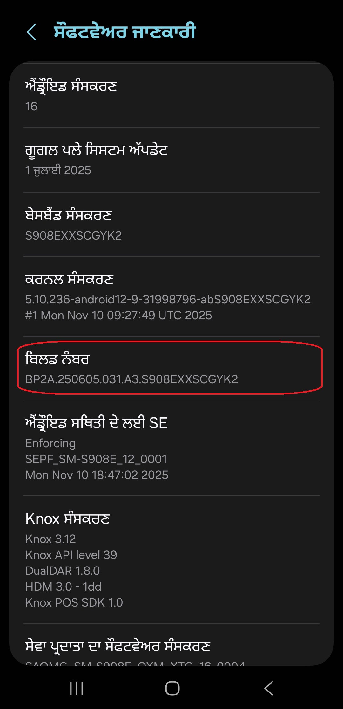
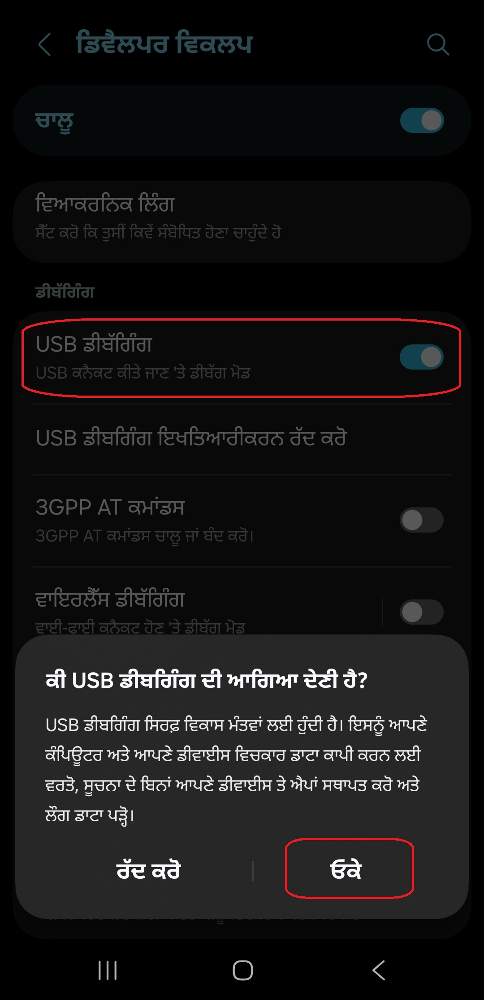
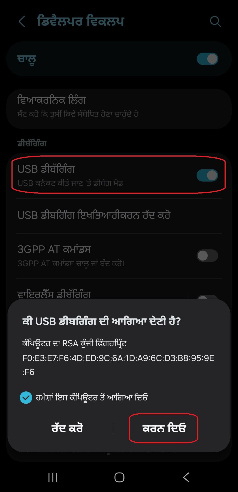

[English](../../README.md) | [Español](../es/README.md)
| [Português](../pt/README.md) | [Bahasa Indonesia](../in/README.md)
| [Русский](../ru/README.md) | [中文 (简体)](../zh-rCN/README.md)
| [日本語](../ja-rJP/README.md) | [Tiếng Việt](../vi/README.md)
| [Türkçe](../tr/README.md)
| [हिन्दी](../hi/README.md) | [বাংলা (ভারত)](../bn-rIN/README.md) | <u>[ਪੰਜਾਬੀ (ਭਾਰਤ)](README.md)</u> | [اردو (پاکستان)](../ur-rPK/README.md) | [العربية](../ar/README.md) | [ไทย](../th/README.md)

# Pixels - ਸਮਾਰਟ ਰੈਜ਼ੋਲਿਊਸ਼ਨ ਅਤੇ DPI ਚੇਂਜਰ

* [ਗੂਗਲ ਪਲੇ ਸਟੋਰ](https://play.google.com/store/apps/details?id=com.tribalfs.pixels)

Pixels ਨੂੰ ਕੰਮ ਕਰਨ ਲਈ **WRITE_SECURE_SETTINGS** ਇਜਾਜ਼ਤ ਦੀ ਲੋੜ ਹੈ (ਇਹ ਰੂਟਿੰਗ ਨਹੀਂ ਹੈ)।

----------------------

### ਸੰਖੇਪ ਵਿੱਚ (TL;DR)

* `adb shell pm grant com.tribalfs.pixels android.permission.WRITE_SECURE_SETTINGS` ਚਲਾਓ
* ਜੇਕਰ ਉੱਚ ਇਜਾਜ਼ਤ (Elevated Permission) ਵਾਲੀ ਐਂਡਰਾਇਡ ਟਰਮੀਨਲ ਐਪ ਦੀ ਵਰਤੋਂ ਕਰ ਰਹੇ ਹੋ, ਤਾਂ
  `pm grant com.tribalfs.pixels android.permission.WRITE_SECURE_SETTINGS` ਚਲਾਓ

----------------------

ਪੀਸੀ (PC) ਦੀ ਵਰਤੋਂ ਕਰਕੇ ADB ਪ੍ਰਕਿਰਿਆ:
----------------------

<details>

### 1. ਫ਼ੋਨ ਦੀਆਂ ਸੈਟਿੰਗਾਂ ਵਿੱਚ ਡਿਵੈਲਪਰ ਮੋਡ (Developer Mode) ਨੂੰ ਸਮਰੱਥ ਕਰੋ

<details>

* ਡਿਵੈਲਪਰ ਵਿਕਲਪਾਂ ਨੂੰ ਸਮਰੱਥ ਕਰਨ ਲਈ _ਸੈਟਿੰਗਾਂ_ > _ढ़ेठ रे घाठे_ > _ਸਾਫਟਵੇਅਰ ਜਾਣਕਾਰੀ_ 'ਤੇ ਜਾਓ ਅਤੇ
  _ਬਿਲਡ ਨੰਬਰ_ 'ਤੇ ਲਗਾਤਾਰ ਸੱਤ (7) ਵਾਰ ਟੈਪ ਕਰੋ।

  

</details>

### 2. USB ਡੀਬਗਿੰਗ (USB debugging) ਨੂੰ ਸਮਰੱਥ ਕਰੋ

<details>

* _ਸੈਟਿੰਗਾਂ_ > _ਵਿਕਾਸਕਾਰ ਵਿਕਲਪ_ 'ਤੇ ਜਾਓ (ਪੁਰਾਣੇ ਐਂਡਰਾਇਡ ਵਰਜ਼ਨਾਂ 'ਤੇ ਇਹ _ਸੈਟਿੰਗਾਂ_ > _ਸਿਸਟਮ_ >
  _ਵਿਕਾਸਕਾਰ ਵਿਕਲਪ_ ਹੋ ਸਕਦਾ ਹੈ), ਹੇਠਾਂ ਸਕ੍ਰੋਲ ਕਰੋ ਅਤੇ _USB ਡੀਬਗਿੰਗ_ ਵਿਕਲਪ ਲੱਭੋ। ਉਸ ਵਿਕਲਪ ਨੂੰ ਸਮਰੱਥ
  ਬਣਾਓ।

  

#### ਕੁਝ ਡਿਵਾਈਸਾਂ (ਜਿਵੇਂ MIUI) ਲਈ ਨੋਟ:

* ਜੇਕਰ ਡਿਵੈਲਪਰ ਵਿਕਲਪਾਂ ਵਿੱਚ _ਸੁਰੱਖਿਆ ਸੈਟਿੰਗਾਂ ਲਈ USB ਡੀਬੱਗਿੰਗ_ ਮੌਜੂਦ ਹੈ ਤਾਂ ਇਸਨੂੰ ਵੀ ਚਾਲੂ ਕਰੋ।

* ਜੇਕਰ ਡਿਵੈਲਪਰ ਵਿਕਲਪਾਂ ਵਿੱਚ _ਅਨੁਮਤੀ ਨਿਗਰਾਨੀ ਨੂੰ ਅਸਮਰੱਥ ਬਣਾਓ_ ਵਿਕਲਪ ਮੌਜੂਦ ਹੈ ਤਾਂ ਇਸਨੂੰ ਚਾਲੂ ਕਰੋ।
  ਰੀਬੂਟ (Reboot) ਦੀ ਲੋੜ ਹੈ।

</details>

### 3. ਆਪਣੇ ਕੰਪਿਊਟਰ 'ਤੇ ADB ਡਾਊਨਲੋਡ ਕਰੋ

<details>

* ਆਪਣੇ ਕੰਪਿਊਟਰ 'ਤੇ ADB (platform-tools) ਡਾਊਨਲੋਡ ਕਰੋ:
  [ਵਿੰਡੋਜ਼](https://dl.google.com/android/repository/platform-tools-latest-windows.zip) ਲਈ |
  [ਮੈਕ](https://dl.google.com/android/repository/platform-tools-latest-darwin.zip) ਲਈ |
  [ਲੀਨਕਸ](https://dl.google.com/android/repository/platform-tools-latest-linux.zip) ਲਈ

* ਡਾਊਨਲੋਡ ਕੀਤੀ ਜ਼ਿਪ ਫ਼ਾਈਲ ਨੂੰ ਐਕਸਟ੍ਰੈਕਟ (Extract) ਕਰੋ।

</details>

### 4. ਫੋਲਡਰ ਦੇ ਅੰਦਰ ਜਾਓ

ਵਿੰਡੋਜ਼ ਐਕਸਪਲੋਰਰ ਜਾਂ ਫਾਈਂਡਰ (macOS) 'ਤੇ ਆਪਣੇ ਐਕਸਟ੍ਰੈਕਟ ਕੀਤੇ `platform-tools` ਫੋਲਡਰ ਦੇ ਅੰਦਰ ਜਾਓ।

### 5. ਕਮਾਂਡ-ਲਾਈਨ ਇੰਟਰਫੇਸ (Command-line Interface) ਖੋਲ੍ਹਣਾ

  <details>

#### ਵਿੰਡੋਜ਼ ਲਈ: CMD ਖੋਲ੍ਹੋ

* ਐਡਰੈੱਸ ਬਾਰ ਵਿੱਚ `cmd` ਟਾਈਪ ਕਰੋ ਅਤੇ ਐਂਟਰ (Enter) ਦਬਾਓ। ਇਹ ਵਿੰਡੋਜ਼ ਕਮਾਂਡ ਪ੍ਰੋਂਪਟ ਐਪਲੀਕੇਸ਼ਨ ਖੋਲ੍ਹ
  ਦੇਵੇਗਾ।

  

#### MacOS ਲਈ: ਟਰਮੀਨਲ (Terminal) ਖੋਲ੍ਹੋ

* Launchpad ਤੋਂ `Terminal` ਲੱਭੋ ਅਤੇ ਇਸਨੂੰ ਚਾਲੂ ਕਰੋ।

* `sudo -s` ਚਲਾਓ ਅਤੇ ਆਪਣਾ ਪਾਸਵਰਡ ਟਾਈਪ ਕਰੋ। **ਟਰਮੀਨਲ ਇਹ ਨਹੀਂ ਦਿਖਾਏਗਾ ਕਿ ਤੁਸੀਂ ਕਿੰਨੇ ਅੱਖਰ ਟਾਈਪ ਕਰ ਰਹੇ
  ਹੋ, ਇਹ ਖਾਲੀ ਰਹੇਗਾ।**

* `export PATH=.:$PATH` ਚਲਾਓ

**ਇਸ ਤੋਂ ਬਿਨਾਂ, ਤੁਹਾਨੂੰ `adb: command not found` ਗਲਤੀਆਂ (Errors) ਮਿਲਣਗੀਆਂ।**

</details>

### 6. ਆਪਣੇ ਫ਼ੋਨ ਨੂੰ ਕੰਪਿਊਟਰ ਨਾਲ ਕਨੈਕਟ ਕਰਨਾ

  <details>

* ਜੇਕਰ ਤੁਹਾਡਾ ਫ਼ੋਨ ਪਹਿਲੀ ਵਾਰ USB ਡੀਬਗਿੰਗ ਮੋਡ 'ਤੇ ਕਨੈਕਟ ਹੋ ਰਿਹਾ ਹੈ ਤਾਂ ਇਹ _वी USB डीघगिंग री भर्गगभा
  रेटी वै?_ ਦਾ
  ਸੁਨੇਹਾ ਦਿਖਾਏਗਾ। _6वे_ 'ਤੇ ਟੈਪ ਕਰੋ।
* ਤੁਸੀਂ _गभेमां प्टिम वंधिड्टव डें भागिभा रिह_ ਨੂੰ ਚੈੱਕ ਕਰ ਸਕਦੇ ਹੋ (USB ਡੀਬਗਿੰਗ ਨੂੰ ਸਮਰੱਥ ਰੱਖਣ ਬਾਰੇ
  ਇਸ
  ਟਿਊਟੋਰਿਅਲ ਦੇ ਅੰਤ ਵਿੱਚ ਨੋਟ ਦੇਖੋ)।

  

* ਹੇਠ ਲਿਖੀ ਕਮਾਂਡ ਦਰਜ ਕਰਕੇ ਐਂਟਰ ਦਬਾਓ ਤਾਂ ਜੋ ਕਨੈਕਸ਼ਨ ਦੀ ਜਾਂਚ ਕੀਤੀ ਜਾ ਸਕੇ। ਜੇਕਰ ਸਫਲਤਾਪੂਰਵਕ ਕਨੈਕਟ ਹੋ ਗਿਆ
  ਹੈ ਤਾਂ ਇਸਨੂੰ ਤੁਹਾਡੀ ਡਿਵਾਈਸ ਆਈਡੀ (Device ID) ਦਿਖਾਉਣੀ ਚਾਹੀਦੀ ਹੈ।

> ```adb devices```


#### macOS ਲਈ: ```./adb devices ```

* ਜੇਕਰ ਤੁਹਾਡੀ ਡਿਵਾਈਸ ਕੰਪਿਊਟਰ ਨਾਲ ਕਨੈਕਟ ਹੋਣ ਵਿੱਚ ਅਸਫਲ ਰਹਿੰਦੀ ਹੈ, ਤਾਂ ਇਸਨੂੰ ਕਿਸੇ ਹੋਰ USB ਪੋਰਟ ਨਾਲ
  ਕਨੈਕਟ ਕਰਨ ਦੀ ਕੋਸ਼ਿਸ਼ ਕਰੋ ਅਤੇ/ਜਾਂ ਇੱਕ ਵੱਖਰੀ USB ਡਾਟਾ ਕੇਬਲ ਦੀ ਵਰਤੋਂ ਕਰੋ। ਜੇਕਰ ਅਜੇ ਵੀ ਕਨੈਕਟ ਨਹੀਂ ਹੋ
  ਰਿਹਾ, ਤਾਂ ਸ਼ਾਇਦ ਤੁਹਾਡੇ ਕੰਪਿਊਟਰ ਵਿੱਚ ਤੁਹਾਡੇ ਫ਼ੋਨ ਲਈ USB ਡਰਾਈਵਰ ਨਹੀਂ ਹਨ।
  [OEM USB ਡਰਾਈਵਰ ਡਾਊਨਲੋਡ ਕਰਨ ਲਈ ਇੱਥੇ ਦੇਖੋ](https://developer.android.com/studio/run/oem-usb#Drivers)।
  ਇੰਸਟਾਲ ਹੋਣ ਤੋਂ ਬਾਅਦ, ਆਪਣੇ ਪੀਸੀ ਨੂੰ ਰੀਬੂਟ ਕਰੋ ਅਤੇ ਪੜਾਅ ਨੰਬਰ 6 ਦੁਬਾਰਾ ਕਰੋ।

</details>

### 7. Pixels ਨੂੰ WRITE_SECURE_SETTINGS ਇਜਾਜ਼ਤ ਦੇਣਾ

  <details>

* ਸਫਲਤਾਪੂਰਵਕ ਕਨੈਕਟ ਹੋਣ 'ਤੇ, ਹੇਠ ਲਿਖੀ ਕਮਾਂਡ ਦਰਜ ਕਰੋ ਅਤੇ ਐਂਟਰ ਦਬਾਓ। ਤੁਸੀਂ ਹੇਠਾਂ ਦਿੱਤੀ ਕਮਾਂਡ ਨੂੰ ਕਾਪੀ
  ਕਰ ਸਕਦੇ ਹੋ। ਜੇਕਰ ਕਮਾਂਡ ਸਹੀ ਤਰ੍ਹਾਂ ਚੱਲ ਗਈ, ਤਾਂ ਇਹ ਖਾਲੀ ਵਾਪਸ ਆਵੇਗੀ।

> ```adb shell pm grant com.tribalfs.pixels android.permission.WRITE_SECURE_SETTINGS```

* ਜੇਕਰ ਇਹ `adb.exe: more than one device/emulator...` ਦਾ ਸੁਨੇਹਾ ਦਿਖਾਉਂਦਾ ਹੈ, ਤਾਂ ਇਸਦੀ ਬਜਾਏ ਹੇਠ ਲਿਖੇ
  ਨੂੰ ਚਲਾਓ:

>
```adb -s [ਪੜਾਅ 6 ਵਿੱਚ ਦਿਖਾਈ ਗਈ ਡਿਵਾਈਸ ਆਈਡੀ] shell pm grant com.tribalfs.pixels android.permission.WRITE_SECURE_SETTINGS```


#### macOS ਲਈ:

```./adb shell pm grant com.tribalfs.pixels android.permission.WRITE_SECURE_SETTINGS ```

#### MIUI, OnePlus ਅਤੇ ਕੁਝ ਹੋਰ ਡਿਵਾਈਸਾਂ ਲਈ ਨੋਟ

ਜੇਕਰ ਤੁਹਾਨੂੰ `java.lang.SecurityException: grantRuntimePermission` ਗਲਤੀ ਮਿਲਦੀ ਹੈ, ਤਾਂ ਇਹਨਾਂ ਕਦਮਾਂ ਦੀ
ਪਾਲਣਾ ਕਰੋ:

1. _ਸੈਟਿੰਗਾਂ_ > _ਵਿਕਾਸਕਾਰ ਵਿਕਲਪ_ 'ਤੇ ਜਾਓ (ਇਹ _ਸੈਟਿੰਗਾਂ_ > _System_ > _ਵਿਕਾਸਕਾਰ ਵਿਕਲਪ_ ਵੀ ਹੋ
   ਸਕਦਾ ਹੈ)
2. ਹੇਠਾਂ ਸਕ੍ਰੋਲ ਕਰੋ ਅਤੇ **USB debugging (Security Settings)** ਨੂੰ ਸਮਰੱਥ ਕਰੋ
3. ਜੇਕਰ ਕੋਈ ਸਾਵਧਾਨੀ ਵਾਲਾ ਸੁਨੇਹਾ (Caution Dialogue) ਦਿਖਾਈ ਦਿੰਦਾ ਹੈ, ਤਾਂ ਅੱਗੇ ਵਧਣ ਲਈ ਇਸਦੇ ਕਦਮਾਂ ਦੀ
   ਪਾਲਣਾ ਕਰੋ।
4. ਆਪਣੀ ਡਿਵਾਈਸ ਨੂੰ ਰੀਬੂਟ ਕਰੋ ਅਤੇ ਸੈਕਸ਼ਨ 7 ਦੇ ਕਦਮਾਂ ਨੂੰ ਦੁਬਾਰਾ ਅਜ਼ਮਾਓ।

**ਬੱਸ ਇੰਨਾ ਹੀ!**
</details>

#### ਹੁਣ ਤੁਸੀਂ USB ਡੀਬਗਿੰਗ ਸੈਟਿੰਗਾਂ ਨੂੰ ਅਯੋਗ ਕਰ ਸਕਦੇ ਹੋ

* **ਮਹੱਤਵਪੂਰਨ**: ਜੇਕਰ ਤੁਸੀਂ ਆਪਣੀ ਡਿਵਾਈਸ 'ਤੇ ਅਜਿਹੇ ਸਕ੍ਰੀਨ ਰੈਜ਼ੋਲਿਊਸ਼ਨ ਨੂੰ ਅਜ਼ਮਾਉਣਾ ਚਾਹੁੰਦੇ ਹੋ ਜੋ
  ਸਿਸਟਮ ਨੂੰ ਕ੍ਰੈਸ਼ ਕਰ ਸਕਦਾ ਹੈ, ਤਾਂ USB ਡੀਬਗਿੰਗ ਨੂੰ ਸਮਰੱਥ ਰੱਖੋ। ਪੜਾਅ 6 ਵਿੱਚ _Always allow from this
  computer_ ਚੈੱਕ ਹੋਣਾ ਚਾਹੀਦਾ ਹੈ। ਸਕ੍ਰੀਨ ਰੈਜ਼ੋਲਿਊਸ਼ਨ ਰੀਸੈਟ ਕਰਨ ਲਈ ADB ਕਮਾਂਡਾਂ:
  `adb shell wm size reset` ਅਤੇ `adb shell wm density reset`।

* ਜੇਕਰ ਤੁਹਾਨੂੰ USB ਡੀਬਗਿੰਗ ਦੀ ਲੋੜ ਨਹੀਂ ਹੈ, ਤਾਂ ਤੁਸੀਂ ਹੁਣ ਅਣਚਾਹੀ ਪਹੁੰਚ ਤੋਂ ਬਚਣ ਲਈ USB ਡੀਬਗਿੰਗ
  ਸੈਟਿੰਗਾਂ ਨੂੰ ਅਯੋਗ ਕਰ ਸਕਦੇ ਹੋ।

* _ਸੈਟਿੰਗਾਂ_ > _ਵਿਕਾਸਕਾਰ ਵਿਕਲਪ_ 'ਤੇ ਜਾਓ, ਹੇਠਾਂ ਸਕ੍ਰੋਲ ਕਰੋ ਅਤੇ _USB ਡੀਬਗਿੰਗ_ ਵਿਕਲਪ ਨੂੰ **ਅਯੋਗ
  ** (Disable) ਕਰੋ।

----------------------
[ਵੀਡੀਓ ਗਾਈਡ](https://youtu.be/hKxc8wqanxA)

</details>

----------------------

ਪੀਸੀ ਦੀ ਵਰਤੋਂ ਕੀਤੇ ਬਿਨਾਂ ADB ਪ੍ਰਕਿਰਿਆਵਾਂ:
----------------------
<details>

### ਵਿਕਲਪ 1: ਤੁਸੀਂ [Shizuku](https://play.google.com/store/apps/details?id=moe.shizuku.privileged.api) ਇੰਸਟਾਲ ਕਰ ਸਕਦੇ ਹੋ

ਅਤੇ ਦਿੱਤੀਆਂ ਹਦਾਇਤਾਂ ਦੀ ਪਾਲਣਾ ਕਰਕੇ ਇਸਨੂੰ ਸਰਗਰਮ ਕਰ ਸਕਦੇ ਹੋ।  
ਇਸ ਤੋਂ ਬਾਅਦ, _Pixels_ ਐਪ 'ਤੇ ਵਾਪਸ ਜਾਓ ਅਤੇ ਰੈਜ਼ੋਲਿਊਸ਼ਨ ਲਾਗੂ ਕਰਕੇ ਇਸਨੂੰ ਇਜਾਜ਼ਤ ਦਿਓ।

### ਵਿਕਲਪ 2: ਤੁਸੀਂ [LADB](https://github.com/tribalfs/LADB/releases) ਇੰਸਟਾਲ ਕਰ ਸਕਦੇ ਹੋ

ਇਸਦੀ ਸੈੱਟਅੱਪ ਗਾਈਡ ਦੀ ਪਾਲਣਾ ਕਰੋ ਅਤੇ ਹੇਠ ਲਿਖੀ ਕਮਾਂਡ ਚਲਾਓ:

`pm grant com.tribalfs.pixels android.permission.WRITE_SECURE_SETTINGS`

**ਨੋਟ:** ਇਸਦੇ ਲਈ Wi-Fi ਨੈੱਟਵਰਕ ਨਾਲ ਕਨੈਕਸ਼ਨ ਲੋੜੀਂਦਾ ਹੈ।  
ਜੇਕਰ `java.lang.SecurityException` ਗਲਤੀ ਆਉਂਦੀ ਹੈ, ਤਾਂ ਉੱਪਰ ਦਿੱਤੇ **ਪੜਾਅ 2** ਦੇ ਨੋਟਸ ਦੇਖੋ।  
**ਮਹੱਤਵਪੂਰਨ:** ਕਈ ਵਾਰ **LADB** ਨੂੰ ਕੰਮ ਕਰਨ ਲਈ ਕੁਝ ਕੋਸ਼ਿਸ਼ਾਂ ਕਰਨੀਆਂ ਪੈਂਦੀਆਂ ਹਨ, ਅਤੇ ਇਹ ਸਾਰੀਆਂ
ਡਿਵਾਈਸਾਂ 'ਤੇ ਕੰਮ ਨਹੀਂ ਕਰ ਸਕਦਾ।
[ਵੀਡੀਓ ਵਾਕਥਰੂ](https://youtu.be/gdPHB9ru238)

</details>


----------------------

### ਤੁਹਾਨੂੰ ਇਸ ਪ੍ਰਕਿਰਿਆ ਨੂੰ ਦੁਹਰਾਉਣ ਦੀ ਲੋੜ ਨਹੀਂ ਹੈ ਜਦੋਂ ਤੱਕ ਤੁਸੀਂ ਐਪ ਨੂੰ ਪੂਰੀ ਤਰ੍ਹਾਂ ਅਣਇੰਸਟਾਲ ਕਰਕੇ ਦੁਬਾਰਾ ਇੰਸਟਾਲ ਨਹੀਂ ਕਰਦੇ।
