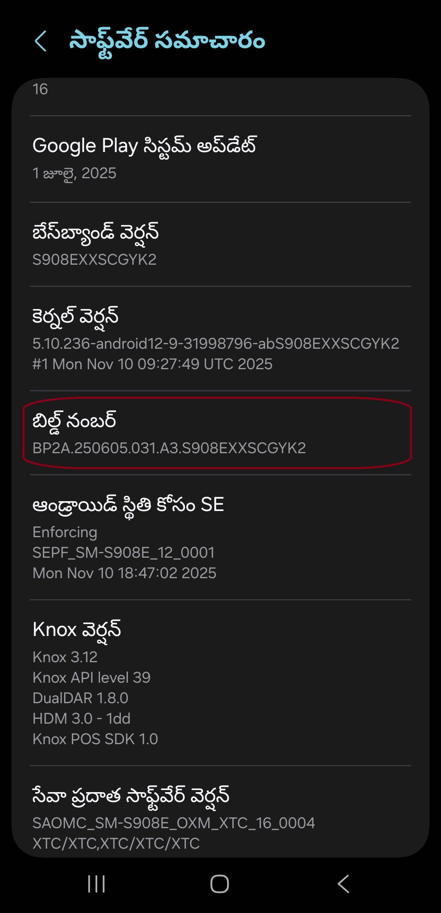
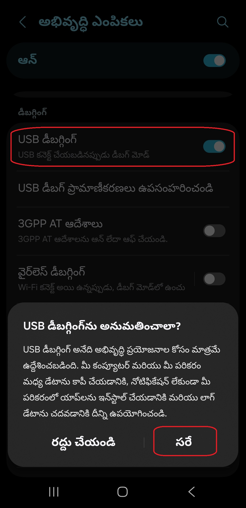
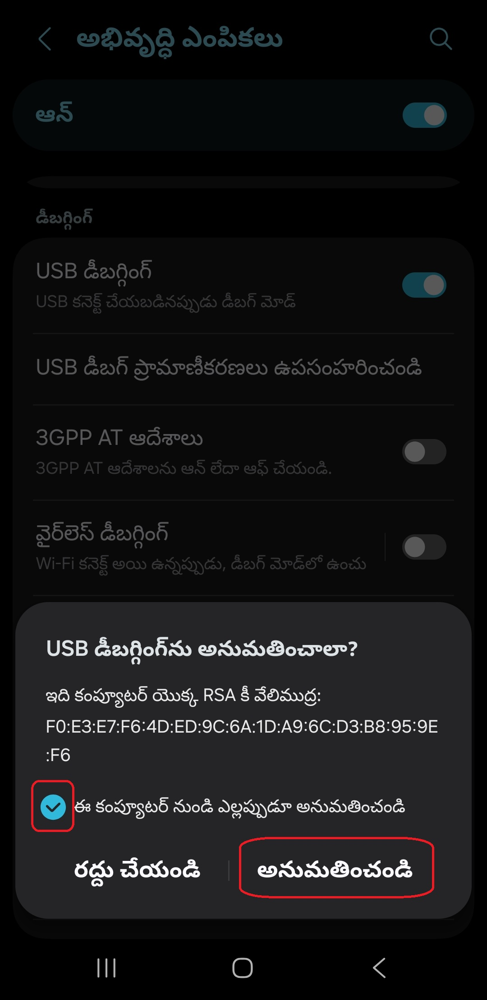

[English](../../README.md) | [Español](../es/README.md)
| [Português](../pt/README.md) | [Bahasa Indonesia](../in/README.md)
| [Русский](../ru/README.md) | [中文 (简体)](../zh-rCN/README.md) | [中文 (繁體)](../zh-rTW/README.md)
| [日本語](../ja-rJP/README.md) | [Tiếng Việt](../vi/README.md)
| [Türkçe](../tr/README.md)
| [हिन्दी](../hi/README.md) | [বাংলা (ভারত)](../bn-rIN/README.md) | [ਪੰਜਾਬੀ (ਭਾਰਤ)](../pa-rIN/README.md) | <u>[తెలుగు](README.md)</u> | [اردو (پاکستان)](../ur-rPK/README.md) | [العربية](../ar/README.md) | [ไทย](../th/README.md)

# Pixels - స్మార్ట్ రిజల్యూషన్ మరియు DPI ఛేంజర్

* [గూగుల్ ప్లే స్టోర్](https://play.google.com/store/apps/details?id=com.tribalfs.pixels)

పిక్సెల్స్ పనిచేయడానికి **WRITE_SECURE_SETTINGS** అనుమతి అవసరం (ఇది రూటింగ్ కాదు).

----------------------

### సంక్షిప్తంగా (TL;DR)

* `adb shell pm grant com.tribalfs.pixels android.permission.WRITE_SECURE_SETTINGS` అమలు చేయండి
* ఎలివేటెడ్ అనుమతులు ఉన్న ఆండ్రాయిడ్ టెర్మినల్ యాప్‌ను ఉపయోగిస్తుంటే,  
  `pm grant com.tribalfs.pixels android.permission.WRITE_SECURE_SETTINGS` అమలు చేయండి

----------------------

పీసీ (PC) ఉపయోగించి ADB ప్రక్రియ:
----------------------

<details>

### 1. ఫోన్ సెట్టింగ్‌లలో డెవలపర్ మోడ్‌ను ప్రారంభించండి

<details>

* _సెట్టింగ్‌లు_ > _ఫోన్ గురించి_ > _సాఫ్ట్‌వేర్ సమాచారం_ కు వెళ్లి _బిల్డ్ నంబర్_
  పై వరుసగా ఏడు (7) సార్లు నొక్కండి తద్వారా **డెవలపర్ ఆప్షన్స్** ప్రారంభమవుతాయి.



</details>

### 2. USB డీబగ్గింగ్‌ను ప్రారంభించండి

<details>

* _సెట్టింగ్‌లు_ > _డెవలపర్ ఆప్షన్స్_ కు వెళ్లండి (పాత ఆండ్రాయిడ్ వెర్షన్‌లలో ఇది _సెట్టింగ్‌లు_ >
  _సిస్టమ్_ > _డెవలపర్ ఆప్షన్స్_ గా ఉండవచ్చు), క్రిందికి స్క్రోల్ చేసి _USB డీబగ్గింగ్_ ఆప్షన్‌ను
  కనుగొనండి.
  ఆ ఎంపికను ప్రారంభించండి.



#### MIUI వంటి కొన్ని పరికరాల కోసం గమనికలు:

* డెవలపర్ ఆప్షన్స్‌లో _USB డీబగ్గింగ్ (సెక్యూరిటీ సెట్టింగ్‌లు)_ ఉంటే దానిని కూడా ప్రారంభించండి.

* డెవలపర్ ఆప్షన్స్‌లో _పర్మిషన్ మానిటరింగ్‌ను నిలిపివేయి_ ఆప్షన్ ఉంటే దానిని ప్రారంభించండి.  
  అనంతరం పరికరాన్ని రీబూట్ చేయాలి.

</details>

### 3. మీ కంప్యూటర్‌లో ADBని డౌన్‌లోడ్ చేయండి

<details>

* మీ కంప్యూటర్‌లో ADB (platform-tools) డౌన్‌లోడ్ చేయండి:  
  [విండోస్](https://dl.google.com/android/repository/platform-tools-latest-windows.zip) |
  [మాక్](https://dl.google.com/android/repository/platform-tools-latest-darwin.zip) |
  [లినక్స్](https://dl.google.com/android/repository/platform-tools-latest-linux.zip)

* డౌన్‌లోడ్ చేసిన ZIP ఫైల్‌ను ఎక్స్‌ట్రాక్ట్ చేయండి.

</details>

### 4. ఫోల్డర్ లోపలికి వెళ్లండి

విండోస్ ఎక్స్‌ప్లోరర్ లేదా ఫైండర్ (macOS) లో మీరు ఎక్స్‌ట్రాక్ట్ చేసిన `platform-tools` ఫోల్డర్‌లోకి
వెళ్లండి.

### 5. కమాండ్-లైన్ ఇంటర్‌ఫేస్‌ను తెరవడం

<details>

#### విండోస్ కోసం: CMD తెరవండి

* అడ్రస్ బార్‌లో `cmd` టైప్ చేసి Enter నొక్కండి. ఇది విండోస్ కమాండ్ ప్రాంప్ట్‌ను తెరుస్తుంది.


#### macOS కోసం: టెర్మినల్ తెరవండి

* Launchpad నుండి `Terminal` వెతికి తెరవండి.
* `sudo -s` అమలు చేసి మీ యూజర్ పాస్‌వర్డ్ టైప్ చేయండి.  
  **టెర్మినల్ మీరు టైప్ చేసే అక్షరాలను చూపించదు.**
* `export PATH=.:$PATH` అమలు చేయండి

**ఇది లేకపోతే `adb: command not found` లోపం వస్తుంది.**

</details>

### 6. మీ ఫోన్‌ను కంప్యూటర్‌కు కనెక్ట్ చేయడం

<details>

* USB డీబగ్గింగ్ మోడ్‌లో మొదటిసారి కనెక్ట్ చేసినప్పుడు,  
  _Allow USB debugging (USB డీబగ్గింగ్‌కు అనుమతి ఇవ్వండి)_ సందేశం కనిపిస్తుంది.  
  _Allow (అనుమతించండి)_ లేదా _OK (సరే)_ నొక్కండి.

*

_Always allow from this computer (ఈ కంప్యూటర్ నుండి ఎల్లప్పుడూ అనుమతించండి)_ ఎంపిక చేయవచ్చు (దీనిపై
గమనిక ట్యుటోరియల్ చివరలో ఉంది).



* కనెక్షన్‌ను తనిఖీ చేయడానికి క్రింది కమాండ్ అమలు చేయండి. సరిగా కనెక్ట్ అయితే పరికరం ID చూపిస్తుంది.

```bash
adb devices
```


#### macOS కోసం:

```bash
./adb devices
```

* పరికరం కనెక్ట్ కాకపోతే, వేరే USB పోర్ట్ లేదా డేటా కేబుల్ ఉపయోగించండి.  
  అవసరమైతే USB డ్రైవర్లు ఇన్‌స్టాల్
  చేయండి: https://developer.android.com/studio/run/oem-usb#Drivers  
  తరువాత PC రీబూట్ చేసి 6వ దశను మళ్లీ చేయండి.

</details>

### 7. పిక్సెల్స్‌కు WRITE_SECURE_SETTINGS అనుమతి ఇవ్వడం

<details>

* విజయవంతంగా కనెక్ట్ అయిన తర్వాత, క్రింది కమాండ్ అమలు చేయండి.  
  సరిగ్గా అమలైతే ఎలాంటి అవుట్‌పుట్ కనిపించదు.

```bash
adb shell pm grant com.tribalfs.pixels android.permission.WRITE_SECURE_SETTINGS
```

* `adb.exe: more than one device/emulator...` లోపం వస్తే:

```bash
adb -s [6వ దశలో చూపిన పరికరం ID] shell pm grant com.tribalfs.pixels android.permission.WRITE_SECURE_SETTINGS
```


#### macOS కోసం:

```bash
./adb shell pm grant com.tribalfs.pixels android.permission.WRITE_SECURE_SETTINGS
```

#### MIUI, OnePlus మరియు ఇతర పరికరాల కోసం గమనిక

`java.lang.SecurityException: grantRuntimePermission` వస్తే:

1. _సెట్టింగ్‌లు_ > _డెవలపర్ ఆప్షన్స్_
2. **USB డీబగ్గింగ్ (సెక్యూరిటీ సెట్టింగ్‌లు)** ప్రారంభించండి
3. హెచ్చరికలు వస్తే సూచనలు అనుసరించండి
4. పరికరాన్ని రీబూట్ చేసి 7వ దశ మళ్లీ ప్రయత్నించండి

**అంతే!**

</details>

#### ఇప్పుడు మీరు USB డీబగ్గింగ్‌ను నిలిపివేయవచ్చు

* **ముఖ్యమైనది**:  
  అసాధారణ రిజల్యూషన్లను పరీక్షించాలంటే USB డీబగ్గింగ్‌ను ప్రారంభంగా ఉంచండి.  
  రీసెట్ కమాండ్‌లు:  
  `adb shell wm size reset`  
  `adb shell wm density reset`

* అవసరం లేకపోతే USB డీబగ్గింగ్‌ను నిలిపివేయండి.

* _సెట్టింగ్‌లు_ > _డెవలపర్ ఆప్షన్స్_ > _USB డీబగ్గింగ్_ → **నిలిపివేయండి**

----------------------
[వీడియో గైడ్](https://youtu.be/hKxc8wqanxA)
----------------------

</details>

----------------------

పీసీ లేకుండా ADB ప్రక్రియ:
----------------------

<details>

### ఆప్షన్ 1: Shizuku

https://play.google.com/store/apps/details?id=moe.shizuku.privileged.api  
ఇన్‌స్టాల్ చేసి గైడ్‌ను అనుసరించండి.

### ఆప్షన్ 2: LADB

https://github.com/tribalfs/LADB/releases

```bash
pm grant com.tribalfs.pixels android.permission.WRITE_SECURE_SETTINGS
```

Wi-Fi అవసరం. కొన్ని పరికరాల్లో పని చేయకపోవచ్చు.

</details>

----------------------

### యాప్‌ను పూర్తిగా అన్‌ఇన్‌స్టాల్ చేసి మళ్లీ ఇన్‌స్టాల్ చేయకపోతే, ఈ ప్రక్రియను మళ్లీ చేయాల్సిన అవసరం లేదు.
