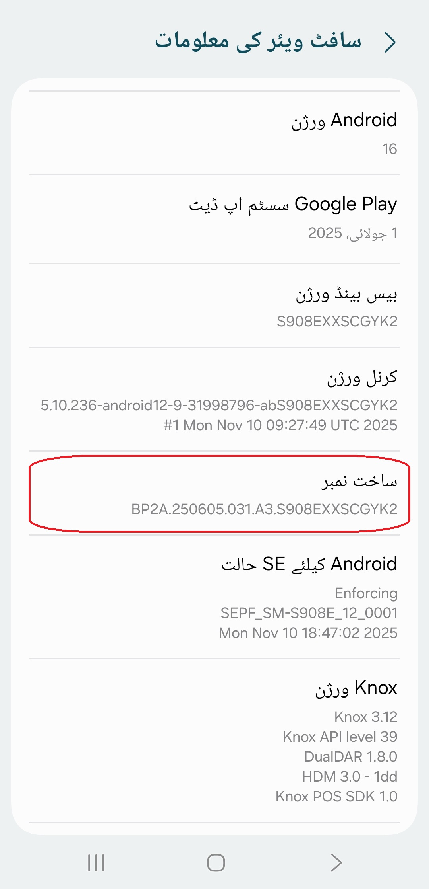
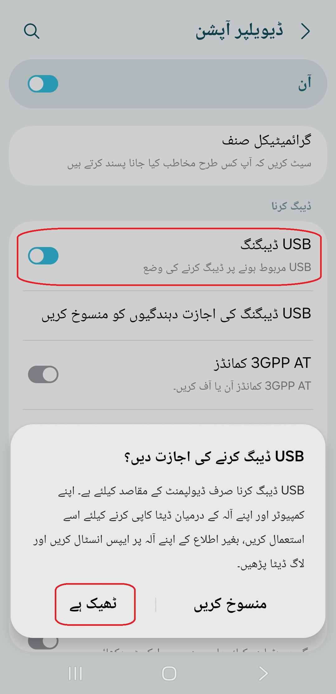
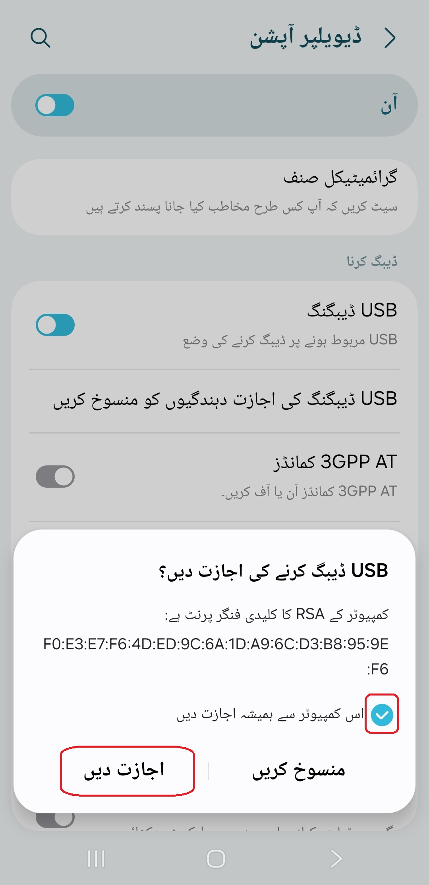

[English](../../README.md) | [Español](../es/README.md)
| [Português](../pt/README.md) | [Bahasa Indonesia](../in/README.md)
| [Русский](../ru/README.md) | [中文 (简体)](../zh-rCN/README.md) | [中文 (繁體)](../zh-rTW/README.md)
| [日本語](../ja-rJP/README.md) | [Tiếng Việt](../vi/README.md)
| [Türkçe](../tr/README.md)
| [हिन्दी](../hi/README.md) | [বাংলা (ভারত)](../bn-rIN/README.md) | [ਪੰਜਾਬੀ (ਭਾਰਤ)](../pa-rIN/README.md) | [తెలుగు](../te-rIN/README.md) | <u>[اردو (پاکستان)](README.md)</u> | [العربية](../ar/README.md) | [ไทย](../th/README.md)

# Pixels - اسمارٹ ریزولوشن اور DPI چینجر

* [گوگل پلے اسٹور](https://play.google.com/store/apps/details?id=com.tribalfs.pixels)

Pixels کو درست طریقے سے کام کرنے کے لیے **WRITE_SECURE_SETTINGS** کی اجازت درکار ہوتی ہے  
(یہ **روٹنگ نہیں** ہے)۔

----------------------

### مختصر خلاصہ (TL;DR)

* یہ کمانڈ چلائیں:  
  `adb shell pm grant com.tribalfs.pixels android.permission.WRITE_SECURE_SETTINGS`
* اگر آپ کسی اینڈرائیڈ ٹرمینل ایپ کو اضافی اجازت (Elevated Permission) کے ساتھ استعمال کر رہے ہیں
  تو:  
  `pm grant com.tribalfs.pixels android.permission.WRITE_SECURE_SETTINGS`

----------------------

پی سی (PC) کے ذریعے ADB کا طریقہ کار
----------------------

<details>

### 1. فون کی سیٹنگز میں ڈیولپر آپشنز فعال کریں

<details>

* _سیٹنگز_ > _فون کے بارے میں_ > _سافٹ ویئر کی معلومات_ پر جائیں اور  
  _بلڈ نمبر_ پر لگاتار سات (7) بار ٹیپ کریں تاکہ **ڈیولپر آپشنز** فعال ہو جائیں۔

  

</details>

---

### 2. USB ڈی بگنگ فعال کریں

<details>

* _سیٹنگز_ > _ڈیولپر آپشنز_ پر جائیں  
  (پرانے اینڈرائیڈ ورژنز میں یہ _سیٹنگز_ > _سسٹم_ > _ڈیولپر آپشنز_ ہو سکتا ہے)،  
  نیچے اسکرول کریں اور _USB ڈی بگنگ_ کا آپشن تلاش کریں۔

  

#### MIUI جیسے کچھ ڈیوائسز کے لیے نوٹس:

* اگر ڈیولپر آپشنز میں _سیکیورٹی سیٹنگز کے لیے USB ڈی بگنگ_ موجود ہو تو اسے بھی آن کریں۔

* اگر ڈیولپر آپشنز میں _پرمیژن مانیٹرنگ غیر فعال کریں_ کا آپشن موجود ہو تو اسے بھی آن کریں۔  
  اس کے بعد ڈیوائس کو ری بوٹ کرنا ضروری ہے۔

</details>

---

### 3. اپنے کمپیوٹر پر ADB ڈاؤن لوڈ کریں

<details>

* ADB (platform-tools) اپنے کمپیوٹر پر ڈاؤن لوڈ کریں:  
  [ونڈوز](https://dl.google.com/android/repository/platform-tools-latest-windows.zip)|
  [میک](https://dl.google.com/android/repository/platform-tools-latest-darwin.zip)|
  [لینکس](https://dl.google.com/android/repository/platform-tools-latest-linux.zip)

* ڈاؤن لوڈ کی گئی ZIP فائل کو ایکسٹریکٹ کریں۔

</details>

---

### 4. `platform-tools` فولڈر کے اندر جائیں

Windows Explorer یا Finder (macOS) میں اس `platform-tools` فولڈر کو کھولیں  
جو آپ نے ایکسٹریکٹ کیا ہے۔

---

### 5. کمانڈ لائن انٹرفیس کھولیں

<details>

#### ونڈوز کے لیے: CMD کھولیں

* ایڈریس بار میں `cmd` لکھیں اور Enter دبائیں۔  
  اس سے Windows Command Prompt کھل جائے گا۔


#### macOS کے لیے: Terminal کھولیں

* Launchpad میں `Terminal` تلاش کریں اور کھولیں۔

* `sudo -s` چلائیں اور اپنا پاس ورڈ درج کریں۔  
  **ٹرمینل میں ٹائپ کیے گئے حروف نظر نہیں آئیں گے۔**

* یہ کمانڈ چلائیں:  
  `export PATH=.:$PATH`

**اس کے بغیر `adb: command not found` کی غلطی آ سکتی ہے۔**

</details>

---

### 6. فون کو کمپیوٹر سے منسلک کریں

<details>

* اگر USB ڈی بگنگ موڈ میں پہلی بار فون کنیکٹ کیا جا رہا ہو تو  
  فون پر _USB ڈی بگنگ کی اجازت دیں_ کا پیغام آئے گا۔  
  _اجازت دیں_ یا _اوکے_ پر ٹیپ کریں۔

* آپ _اس کمپیوٹر سے ہمیشہ اجازت دیں_ کا آپشن بھی منتخب کر سکتے ہیں  
  (USB ڈی بگنگ فعال رکھنے سے متعلق نوٹ نیچے دیا گیا ہے)۔

  

* کنکشن چیک کرنے کے لیے یہ کمانڈ چلائیں:

```adb devices```

اگر کنکشن درست ہے تو آپ کی ڈیوائس آئی ڈی ظاہر ہو جائے گی۔


#### macOS کے لیے:

```./adb devices```

* اگر ڈیوائس کنیکٹ نہ ہو تو:
    - کسی اور USB پورٹ سے کنیکٹ کریں
    - یا کوئی دوسری USB ڈیٹا کیبل استعمال کریں

  اگر پھر بھی کنیکٹ نہ ہو تو ممکن ہے USB ڈرائیور انسٹال نہ ہوں۔  
  OEM USB ڈرائیورز ڈاؤن لوڈ کرنے کے لیے  
  [یہاں دیکھیں](https://developer.android.com/studio/run/oem-usb#Drivers)۔  
  انسٹال کرنے کے بعد PC ری بوٹ کریں اور مرحلہ 6 دوبارہ کریں۔

</details>

---

### 7. Pixels کو WRITE_SECURE_SETTINGS کی اجازت دینا

<details>

* کامیابی سے کنیکٹ ہونے کے بعد یہ کمانڈ چلائیں:

```adb shell pm grant com.tribalfs.pixels android.permission.WRITE_SECURE_SETTINGS```

اگر کمانڈ درست چلی تو کوئی آؤٹ پٹ ظاہر نہیں ہو گا۔

* اگر یہ پیغام آئے:  
  `adb.exe: more than one device/emulator...`  
  تو یہ کمانڈ استعمال کریں:

```adb -s [مرحلہ 6 میں دکھائی گئی ڈیوائس آئی ڈی] shell pm grant com.tribalfs.pixels android.permission.WRITE_SECURE_SETTINGS```


#### macOS کے لیے:

```./adb shell pm grant com.tribalfs.pixels android.permission.WRITE_SECURE_SETTINGS```

#### MIUI، OnePlus اور کچھ دیگر ڈیوائسز کے لیے نوٹ

اگر `java.lang.SecurityException: grantRuntimePermission` ایرر آئے تو:

1. _سیٹنگز_ > _ڈیولپر آپشنز_ پر جائیں
2. **USB ڈی بگنگ (سیکیورٹی سیٹنگز)** فعال کریں
3. اگر کوئی تنبیہی پیغام آئے تو اس کی ہدایات پر عمل کریں
4. ڈیوائس ری بوٹ کریں اور مرحلہ 7 دوبارہ آزمائیں

**بس اتنا ہی!**

</details>

### اب آپ USB ڈی بگنگ غیر فعال کر سکتے ہیں

* **اہم**: اگر آپ غیر معمولی اسکرین ریزولوشن آزمانا چاہتے ہیں  
  جو سسٹم کریش کا باعث بن سکتے ہیں، تو USB ڈی بگنگ فعال رکھیں۔  
  مرحلہ 6 میں _اس کمپیوٹر سے ہمیشہ اجازت دیں_ منتخب ہونا چاہیے۔

  ریزولوشن ری سیٹ کرنے کی ADB کمانڈز:
    - `adb shell wm size reset`
    - `adb shell wm density reset`

* اگر USB ڈی بگنگ کی ضرورت نہیں تو سیکیورٹی کے لیے اسے بند کر دیں۔

* _سیٹنگز_ > _ڈیولپر آپشنز_ میں جا کر  
  _USB ڈی بگنگ_ کو **غیر فعال** کر دیں۔

----------------------
[ویڈیو گائیڈ](https://youtu.be/hKxc8wqanxA)
----------------------

</details>

----------------------

پی سی کے بغیر ADB کا طریقہ کار
----------------------

<details>

### آپشن 1: Shizuku انسٹال کریں

[Shizuku](https://play.google.com/store/apps/details?id=moe.shizuku.privileged.api) انسٹال کریں  
اور اس کی دی گئی ہدایات کے مطابق اسے فعال کریں۔  
بعد میں Pixels ایپ میں جا کر ریزولوشن لاگو کریں، اجازت خود بخود مل جائے گی۔

---

### آپشن 2: LADB انسٹال کریں

[LADB](https://github.com/tribalfs/LADB/releases) انسٹال کریں  
اور اس کی سیٹ اپ گائیڈ کے مطابق یہ کمانڈ چلائیں:

`pm grant com.tribalfs.pixels android.permission.WRITE_SECURE_SETTINGS`

**نوٹ:**

- Wi-Fi نیٹ ورک سے منسلک ہونا ضروری ہے
- اگر `java.lang.SecurityException` آئے تو اوپر مرحلہ 2 کے نوٹس دیکھیں
- LADB بعض اوقات کئی کوششوں کے بعد کام کرتا ہے
- یہ تمام ڈیوائسز پر لازمی طور پر کام نہیں کرتا

</details>

----------------------

### جب تک آپ ایپ کو مکمل طور پر اَن انسٹال کر کے دوبارہ انسٹال نہ کریں،

### اس عمل کو دہرانے کی ضرورت نہیں ہے۔
