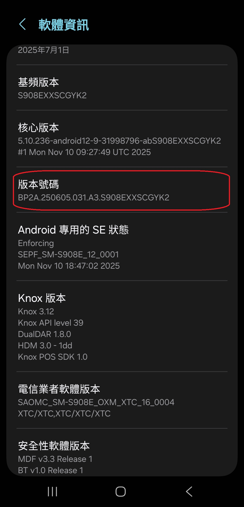
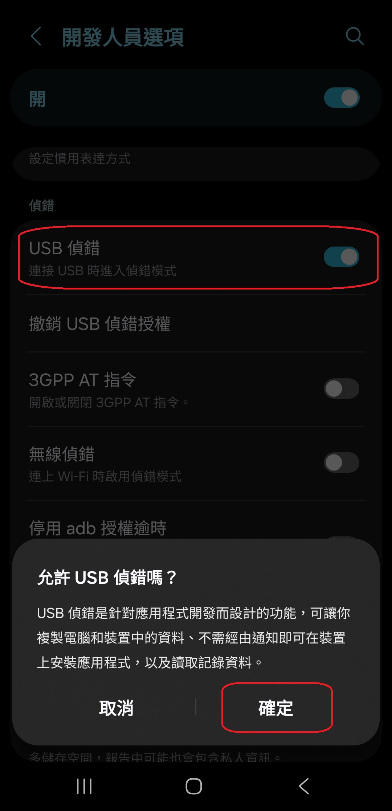
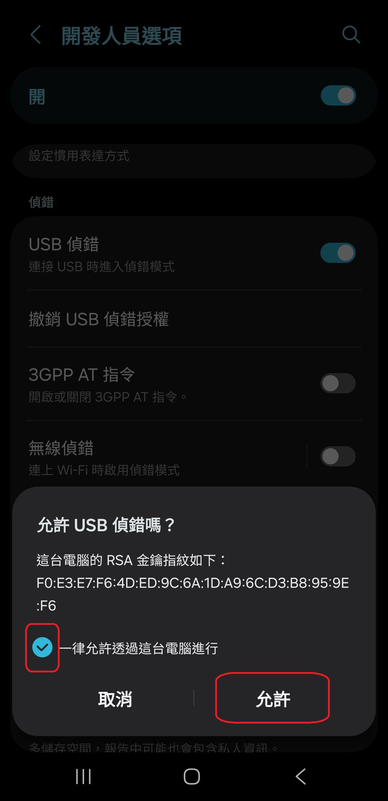

[English](../../README.md) | [Español](../es/README.md)
| [Português](../pt/README.md) | [Bahasa Indonesia](../in/README.md)
| [Русский](../ru/README.md) | [中文 (简体)](../zh-rCN/README.md) | <u>[中文 (繁體)](README.md)</u>
| [日本語](../ja-rJP/README.md) | [Tiếng Việt](../vi/README.md)
| [Türkçe](../tr/README.md)
| [हिन्दी](../hi/README.md) | [বাংলা (ভারত)](../bn-rIN/README.md) | [ਪੰਜਾਬੀ (ਭਾਰਤ)](../pa-rIN/README.md) | [తెలుగు](../te-rIN/README.md) | [اردو (پاکستان)](../ur-rPK/README.md) | [العربية](../ar/README.md) | [ไทย](../th/README.md)

# Pixels - 智慧解析度與 DPI 更改器

* [Google Play 商店](https://play.google.com/store/apps/details?id=com.tribalfs.pixels)

Pixels 需要 **WRITE_SECURE_SETTINGS** 權限才能運作（這不是 Root）。

----------------------

### 太長不看 (TL;DR)

* 執行 `adb shell pm grant com.tribalfs.pixels android.permission.WRITE_SECURE_SETTINGS`。
* 如果使用具有提升權限的 Android 終端應用程式，執行
  `pm grant com.tribalfs.pixels android.permission.WRITE_SECURE_SETTINGS`。

----------------------

使用 PC 的 ADB 程序：
----------------------

<details>

### 1. 在手機設定中啟用開發者模式

<details>

* 前往「設定」 > 「關於手機」 > 「軟體資訊」，然後連續點擊「版本號碼」七 (7) 次以啟用開發人員選項。
* 

</details>

### 2. 啟用 USB 偵錯

<details>

* 前往「設定」 > 「開發人員選項」（在舊版 Android 上可能是「設定」 > 「系統」 > 「開發人員選項」），向下捲動並找到「USB
  偵錯」選項。 啟用該選項。

  

#### 某些裝置（如 MIUI）的注意事項：

* 如果「開發人員選項」中存在「USB 偵錯（安全設定）」，也請開啟。

* 如果「開發人員選項」中存在「停用權限監控」選項，請開啟。需要重新啟動。

</details>

### 3. 在您的電腦上下載 ADB

<details>

* 將 ADB (platform-tools) 下載到您的電腦：
  [Windows 版](https://dl.google.com/android/repository/platform-tools-latest-windows.zip) |
  [Mac 版](https://dl.google.com/android/repository/platform-tools-latest-darwin.zip) |
  [Linux 版](https://dl.google.com/android/repository/platform-tools-latest-linux.zip)

* 解壓縮下載的 zip 檔案。

</details>

### 4. 導航到

您在 Windows 檔案總管或 Finder (macOS) 中解壓縮的 `platform-tools` 資料夾

### 5. 開啟命令列介面

<details>

#### 對於 Windows：開啟 CMD

* 在地址欄中鍵入 `cmd` 並按 Enter。這將開啟 Windows 命令提示字元應用程式。


#### 對於 macOS：開啟終端機

* 從啟動台搜尋「終端機」並執行 it。

* 執行 `sudo -s` 並輸入您的使用者密碼。**終端機不會顯示您鍵入的字元數，它將保持空白。**

* 執行 `export PATH=.:$PATH`

**否則，您將收到 `adb: command not found` 錯誤。**

</details>

### 6. 將手機連接到電腦

<details>

* 如果是第一次在 USB 上連接偵錯模式，您的手機將提示「允許USB偵錯嗎?」。點擊「允許」或「確定」。
* 您可以勾選「一律允許透過這台電腦進行」（請在本教學末尾查看有關保持啟用 USB 偵錯的說明）。

  

* 通過輸入以下命令並按 Enter 來檢查連接。如果連接成功，它應該會顯示您的裝置 ID。

```adb devices```


#### 對於 macOS：  ```./adb devices ```

* 如果您的裝置無法連接到您的電腦，請嘗試將其連接到其他 USB 埠和/或使用不同的 USB
  數據線。如果仍然無法連接，則您的電腦可能缺少您手機的 USB
  驅動程式。在此處[下載 OEM USB 驅動程式](https://developer.android.com/studio/run/oem-usb#Drivers)
  。安裝後，重新啟動您的 PC 並重做第 6 步。

</details>

### 7. 實際授予 Pixels WRITE_SECURE_SETTINGS 權限

<details>

* 連接成功後，輸入以下命令並按 Enter。您可以複製下面的命令。如果命令執行正確，它將返回空白。

```adb shell pm grant com.tribalfs.pixels android.permission.WRITE_SECURE_SETTINGS```

* 如果提示 `adb.exe: more than one device/emulator...`，請改為執行以下命令：

>
```adb -s [步驟 6 中顯示的裝置 ID] shell pm grant com.tribalfs.pixels android.permission.WRITE_SECURE_SETTINGS```


#### 對於 macOS：

```./adb shell pm grant com.tribalfs.pixels android.permission.WRITE_SECURE_SETTINGS ```

#### MIUI、OnePlus 和其他一些裝置的注意事項

如果您收到 `java.lang.SecurityException: grantRuntimePermission` 錯誤，請按照以下步驟操作：

1. 前往「設定」 > 「開發人員選項」（可以是「設定」 > 「系統」 > 「開發人員選項」）
2. 向下捲動並啟用 **USB 偵錯（安全設定）**
3. 如果出現任何「警告對話方塊」，請按照其步驟進行操作。
4. 重新啟動您的裝置並重試第 7 節的步驟。

**就是這樣！**
</details>

#### 您現在可以停用 USB 偵錯設定

* **重要提示**：如果您想在您的裝置上嘗試可能會使系統崩潰的奇異螢幕解析度，請保持啟用 USB 偵錯。應在步驟
  6 中勾選「一律允許透過這台電腦進行」。重置螢幕解析度的 ADB 命令：`adb shell wm size reset` 和
  `adb shell wm density reset`。

* 如果您不需要 USB 偵錯，您現在可以停用 USB 偵錯設定以避免潛在的不必要存取。

* 前往「設定」 > 「開發人員選項」，向下捲動一頁並 **停用** 「USB 偵錯」選項。

----------------------
[影片指南](https://youtu.be/hKxc8wqanxA)

----------------------
</details>

----------------------
不使用 PC 的 ADB 程序：
----------------------
<details>

### 選項 1：您可以安裝 [Shizuku](https://play.google.com/store/apps/details?id=moe.shizuku.privileged.api)

並按照其提供的指南激活它。然後返回「Pixels」應用程式以通過應用解析度來授予其權限。

### 選項 2：您可以安裝 [LADB](https://github.com/tribalfs/LADB/releases)

並按照其設定指南執行以下命令：

`pm grant com.tribalfs.pixels android.permission.WRITE_SECURE_SETTINGS`

注意：這需要連接到 Wi-Fi 網路。如果出現 java.lang.SecurityException, 請檢查上面的步驟 2
中的注意事項。重要提示：LADB 有時需要嘗試幾次才能使其工作，並且它可能無法在所有裝置上工作。

</details>


----------------------

### 除非您完全解除安裝並重新安裝該應用程式，否則您不必重複此程序。
